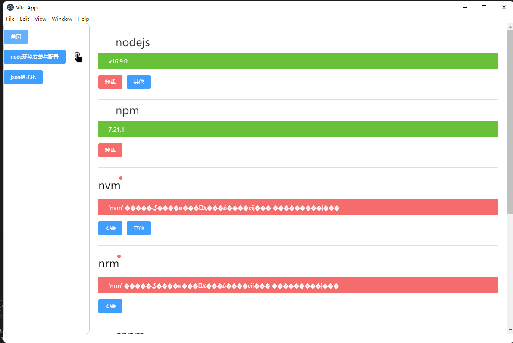
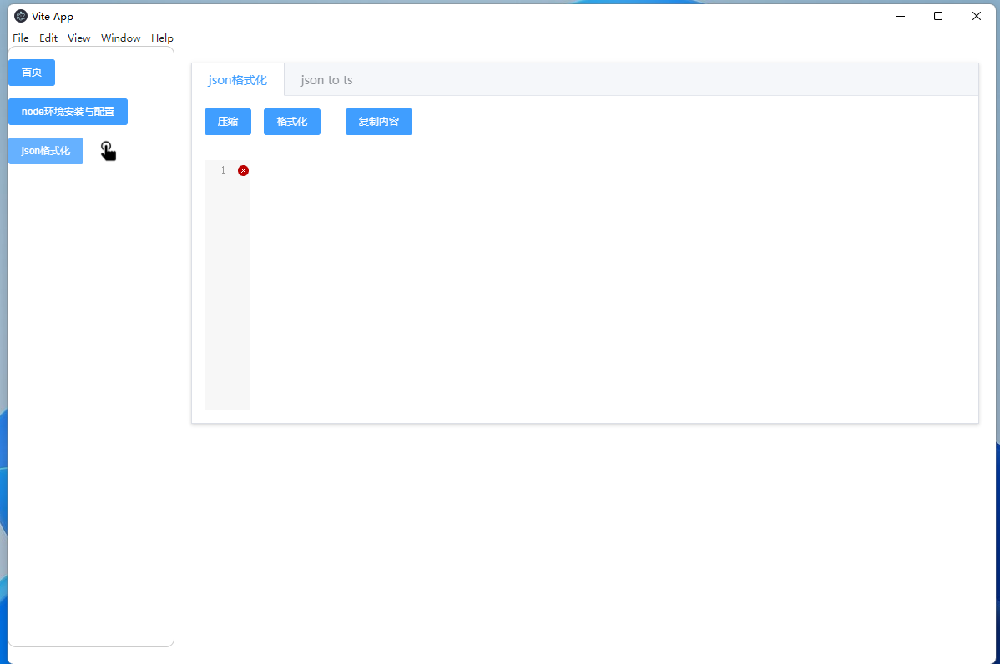
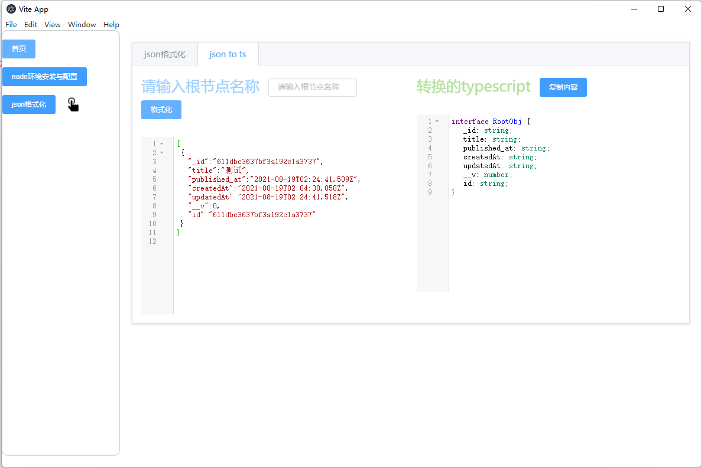

# 功能
- 开发环境配置
- 开发ide安装

# 运行
- `npm run z`
# 打包
- `npm run dist`
# 其他
- 编辑器使用webstorm 
  - 配置Prettier  实现代码保存自动格式化
    - 详细参考 https://prettier.bootcss.com/docs/webstorm.html
# 依赖
- concurrently 同时运行多条命令
- prettier 代码格式化
- debugout.js 前端日志
- vitejs-plugin-electron electron ESModule使用
- codemirror 代码编辑器
- json-to-ts json转换为ts文件

# 完成
- 安装环境检测 
- json格式化 
- json转换ts 
# 下载
- win x64
  - [百度云网盘地址(windows安装包)](https://pan.baidu.com/s/1l0GtwhxAFPXV-xKWDWOuHg)
  - 提取码：emw6
